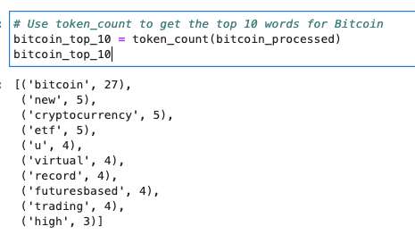
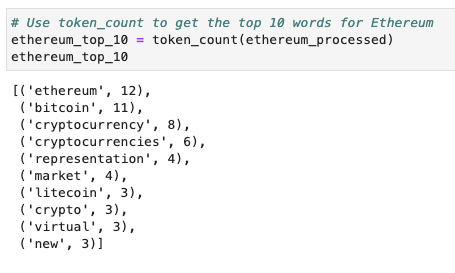
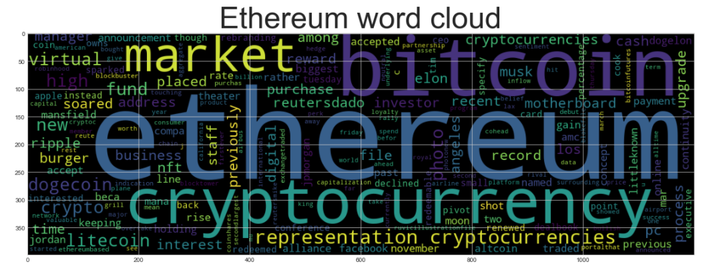
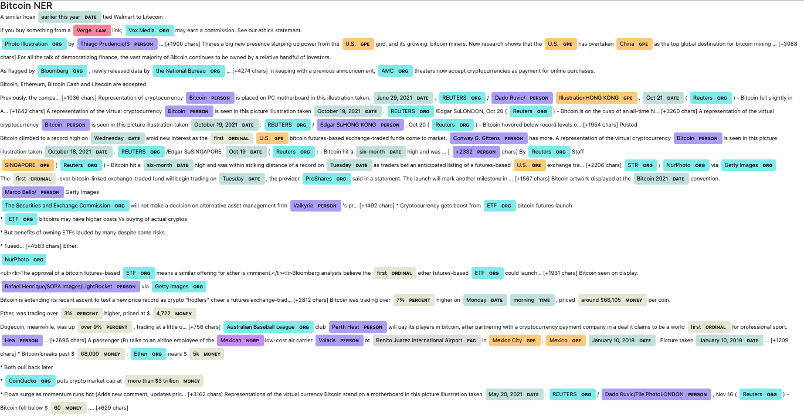
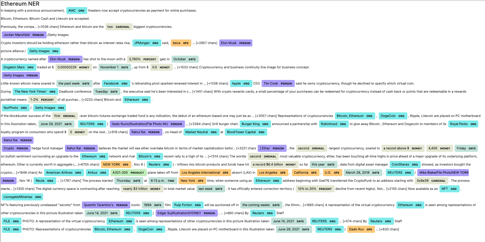

# NLP_HW
# Unit 12—Tales from the Crypto

## Background

There's been a lot of hype in the news lately about cryptocurrency, so you want to take stock, so to speak, of the latest news headlines regarding Bitcoin and Ethereum to get a better feel for the current public sentiment around each coin.

In this assignment, I applied natural language processing to understand the sentiment in the latest news articles featuring Bitcoin and Ethereum. I also applied fundamental NLP techniques to better understand the other factors involved with the coin prices such as common words and phrases and organizations and entities mentioned in the articles.

I completed the following tasks:

1. [Sentiment Analysis](#1---Sentiment-Analysis)
2. [Natural Language Processing](#2---Natural-Language-Processing)
3. [Named Entity Recognition](#3---Named-Entity-Recognition)

---

## Files

[Starter Notebook](Starter_Code/crypto_sentiment.ipynb)

---

### 1 - Sentiment Analysis

I used the [newsapi](https://newsapi.org/) to pull the latest news articles for Bitcoin and Ethereum and create a DataFrame of sentiment scores for each coin.

Based on the information above the following questions can be answered:

Q: Which coin had the highest mean positive score?
 
A: Ethereum had the highest mean positive score with 0.063150 compared to Bitcoin with 0.054550 

Q: Which coin had the highest compound score?
 
A: Ethereum had the highest compound score with 0.822500 compared to Bitcoin with 0.755800 

Q. Which coin had the highest positive score?
 
A: Ethereum had the highest positive score with 0.221000 compared to Bitcoin with 0.199000 

### 2 - Natural Language Processing

In this section, I used NLTK and Python to tokenize text, find n-gram counts, and create word clouds for both coins. 

#### Tokenize

I made sure to:

1. Lowercase each word.
2. Remove punctuation.
3. Remove stop words.

#### N-grams

Next, I looked at the ngrams and word frequency for each coin.

1. Use NLTK to produce the ngrams for N = 2.
2. List the top 10 words for each coin.

##### Top 10 Bitcoin

##### Top 10 Ethereum

#### Word Clouds

Finally, I generated word clouds for each coin to summarize the news for each coin.

##### Bitcoin

##### Ethereum

### 3 - Named Entity Recognition

In this section, I built a named entity recognition model for both coins and visualized the tags using SpaCy.

##### Bitcoin

##### Ethereum

### Resources

[Vader Sentiment Analysis](http://www.nltk.org/howto/sentiment.html)

